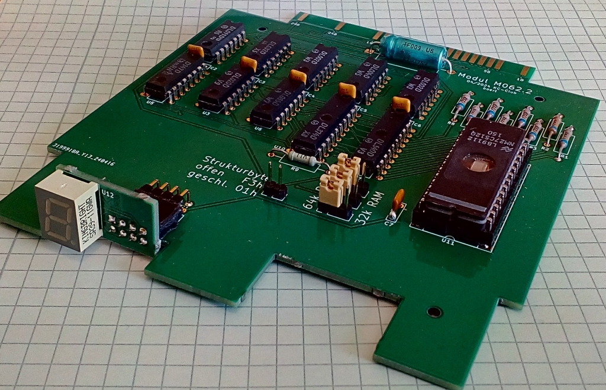
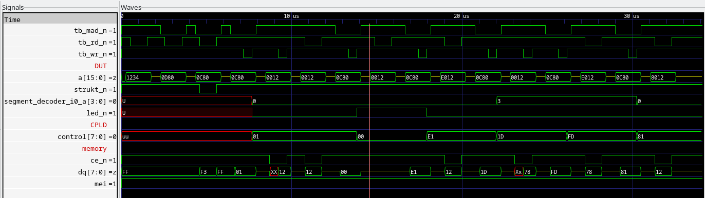
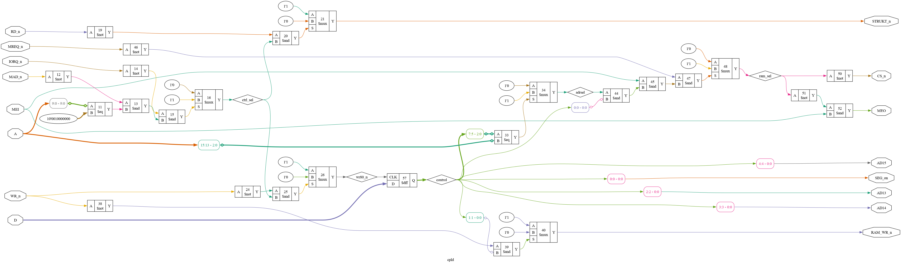
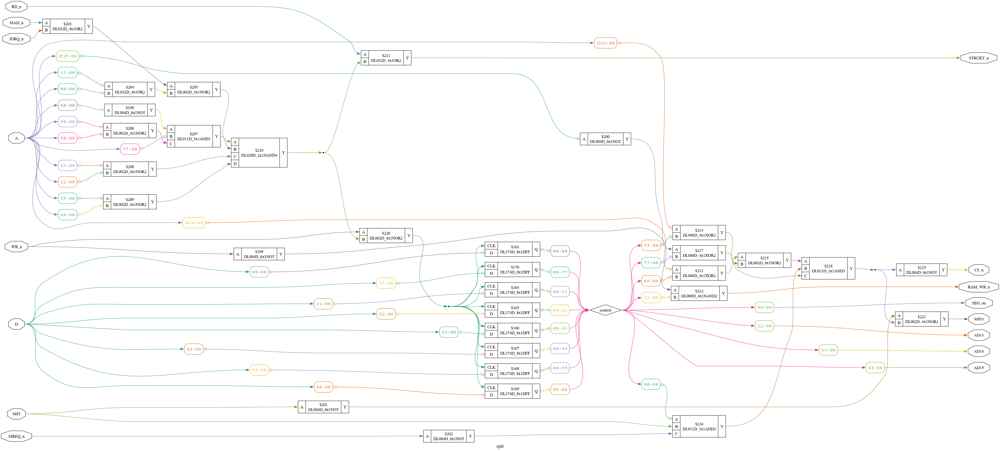

# M062.2, Speichermodul für KC85
TTL-Version des Speichermodul M062 für den KC85/3..4..5 mit 32 kByte RAM (nichtflüchtig) oder 64 kByte EPROM

## Motivation
Um die Erweiterung der EPROM-Generator-Software [^1] zu testen, wurde eine passende Hardware benötigt.
Das M062 von E. Müller ist ein Speichermodul für den KC85 aus Mühlhausen, das entweder mit einem EPROM (64 kByte) oder einem nichtflüchtgen SRAM (32 kByte) bestückt werden kann. Durch den Einsatz eines CPLD werden im Original nur vier Schaltkreise benötigt.

Die hier vorgestellte Lösung entstand auf Basis einer Schaltungsbeschreibung in VHDL.

Mit Hilfe von yosys [^2] und dem ghdl-plugin [^3] ist es möglich aus der Schaltungsbeschreibung eine Netzliste zu erzeugen, die Elemente aus einer bereitgestellten TTL-Bibliothek verwendet.

  
&nbsp;
  

Diese Netzliste wurde als Basis für den Schaltplan herangezogen.
Inklusive Speicher werden nun elf Schaltkreise benötigt.

Änderungen gegenüber dem Original
- Einsatz diskreter TTL-Schaltkreise statt CPLD
- Unterstützung für Schreibschutzbit W im Steuerbyte
- Strukturbyte zwischen F3h und 01h (Autostart) umschaltbar

Übernommen wurde die Idee mit der kleinen Zusatzplatine für die Segmentanzeige.

## Nutzung
Das Steuerbyte ist wie folgt aufgebaut:

Bit       | 7 | 6 | 5 | 4 | 3 | 2 | 1 | 0
--------- | - | - | - | - | - | - | - | -
Bedeutung | A | A | A | S | S | S | W | M

Das Speichermodul kann aus dem System CAOS mit dem Befehl SWITCH geschaltet werden.

Bit 7 | Bit 6 | Bit 5 | Adressauswahl A
----- | ----- | ----- | ---------------
0 | 0 | 0 | 0000h
0 | 0 | 1 | 2000h
0 | 1 | 0 | 4000h
0 | 1 | 1 | 6000h
1 | 0 | 0 | 8000h
1 | 0 | 1 | A000h
1 | 1 | 0 | C000h
1 | 1 | 1 | E000h

Bit 4 | Bit 3 | Bit 2 | Segment S
----- | ----- | ----- | ---------
0 | 0 | 0 | 0
0 | 0 | 1 | 1
0 | 1 | 0 | 2
0 | 1 | 1 | 3
1 | 0 | 0 | 4
1 | 0 | 1 | 5
1 | 1 | 0 | 6
1 | 1 | 1 | 7

Die Segmente 4 bis 7 existieren nur bei Bestückung mit 64 kByte EPROM.

Bit 1 | Schreibschutz W
----- | ------
0 | aktiv (read only)
1 | inaktiv (read write)

Bit 0 | Modulzustand M
----- | ------
0 | inaktiv
1 | aktiv

### Beispiel
Angenommen das Modul M062.2 steckt im Modulschacht 0C. 

Um das Segement 3 im Speicher auf Adresse 4000h im Modus Schreiben/Lesen zu aktivieren, wird der CAOS-Befehl "SWITCH C 4F" verwendet. 

Um das Segement 7 im Speicher auf Adresse C000h im Modul Nur-Lesen zu aktivieren, wird der CAOS-Befehl "SWITCH C DD" verwendet.

## Links
[^1]: https://github.com/boert/KC85__M037_segmented_ROM/tree/main/EPROM-Generator
[^2]: https://yosyshq.net/yosys/
[^3]: https://github.com/ghdl/ghdl-yosys-plugin
